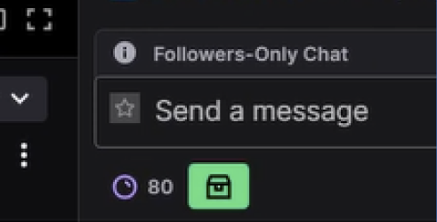
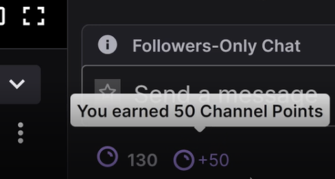

# twitch-extension

# Goal

An extension to automatically collect the Twitch Channel Points during a Twitch live stream. You do not have to click on the green button to collect Points. You can enjoy the stream in full screen or even close chat (where the collect button is located). The extension will collect all collectable Points during a stream (you can collect Points every x minutes). It also works if you open another live stream.

# Tools

The scripts is written in JavaScript and uses a MutationObserver to manipulate the DOM.

# Usage

To use the extension in Google Chrome, you can go to your extension menu and load the folder "extension" with the option "Load unpacked". To use the extension a refresh is needed.

# Visual

### Before

### After

### Gif

# Further improvements

/
